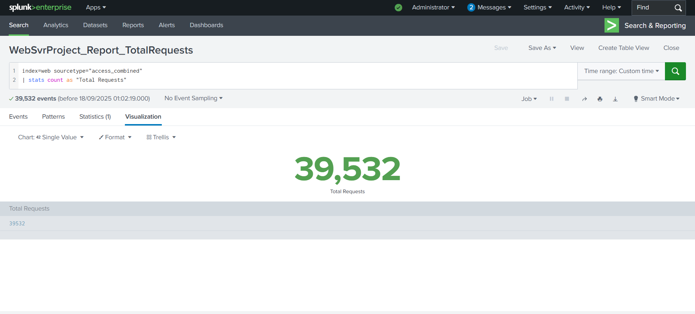
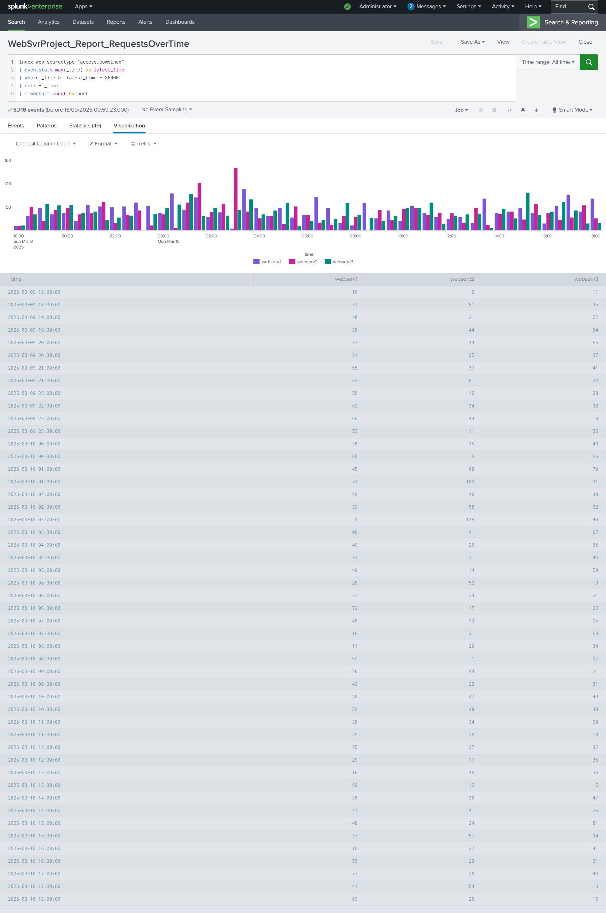
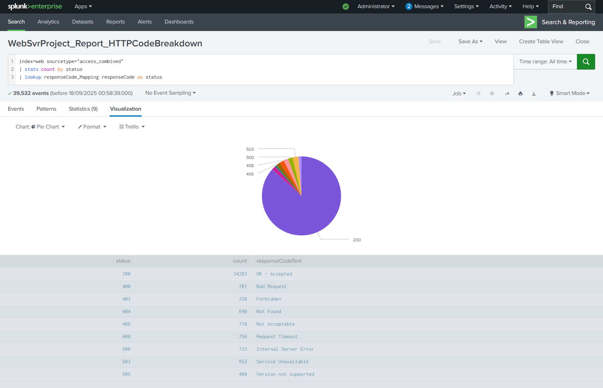
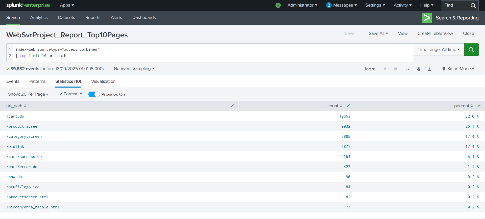
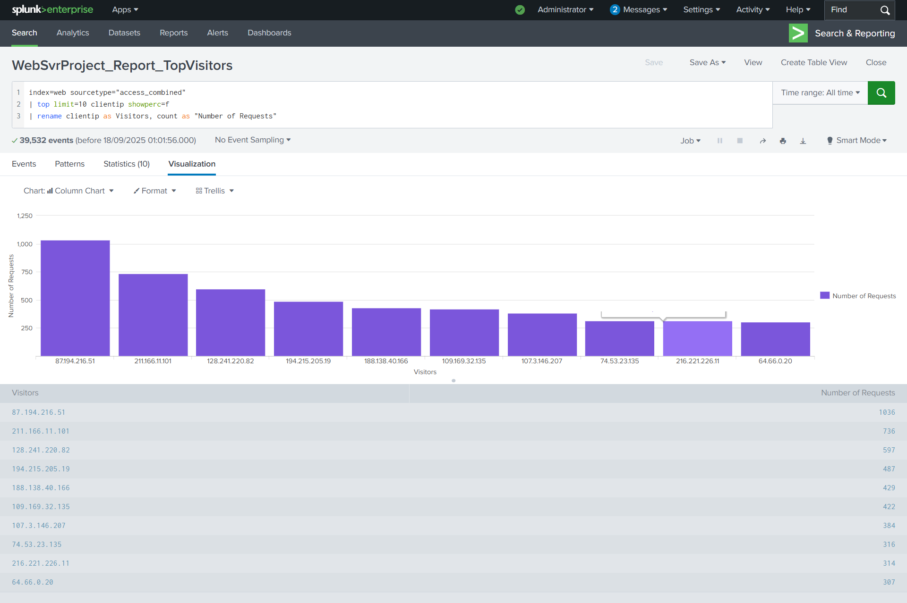
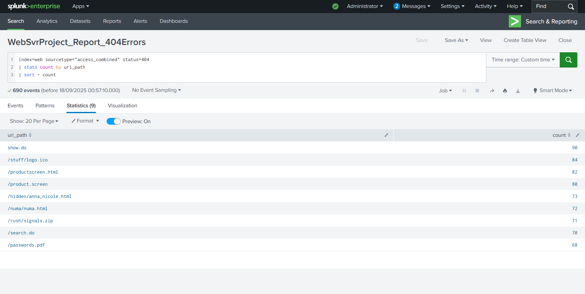
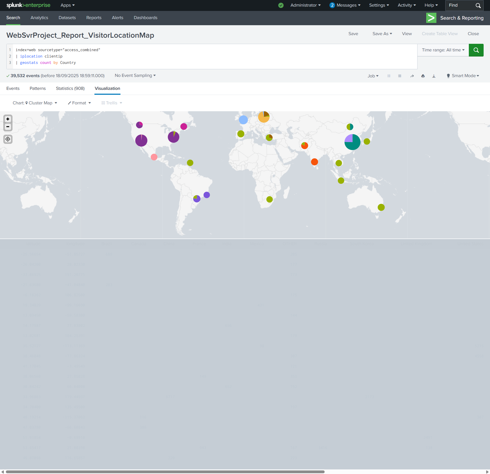

# Web Server Operations Dashboard

Welcome! The goal of this project was to build a Web Operations Dashboard that gives an overview of the servers' activity while demonstrating SPL skills, from simple searches to creating rich visualizations.

---
# Step 1: Importing the data into my local Splunk instance.
The first step to searching, analysing and visualizing data in Splunk is importation i.e. getting the data into Splunk. I found a data set that contained access logs from three(3) seperate web servers. The data was added to an index called **web** using the sourcetype **access_combined**. I will provide a link to the dataset utilized for this project. 
# Step 2: Running SPL Queries to filter through the data
With an end goal of creating a dashboard with seven (7) panels that provide an operational overview, the first step is to run search queries for each of them. 
## Query 1: Total Requests
A foundational query that calculates the total number of web requests. This is perfect for a **single value panel** in a dashboard.
```splunk-spl
index=web sourcetype="access_combined"
| stats count as "Total Requests"
```
- `index=web sourcetype="access_combined"`: This is the starting point. It tells Splunk to search for all events from our web access logs.
- `| stats count as "Total Requests"`: This command counts all the events and gives the final number a clean, readable name: "Total Requests".


## Query 2: Analyzing Requests Over Time
This query goes a step further by filtering for recent data and visualizing request trends as timechart to view traffic patterns across the webservers over a 24-hour period.
```splunk-spl
index=web sourcetype="access_combined"
| eventstats max(_time) as latest_time
| where _time >= latest_time - 86400
| sort - _time
| timechart count by host
```
- `| eventstats max(_time) as latest_time`: We use eventstats to find the most recent event timestamp and apply it to every event in the search.
- `| where _time >= latest_time - 86400`: This filters the results to only include events from the last 24 hours (86,400 seconds).
- `| timechart count by host`: This command visualizes the data on a chart, showing request counts over time, broken down by the originating host.


## Query 3: HTTP Status Code Breakdown
Raw status codes like 404 or 200 are just numbers. In order to give the codes more meaningful descriptions and make the analysis clearer and more presentable for whoever views the dashboard, i utilized a **lookup table** named ***responseCode_Mapping.csv***. This table was imported into my local instance and a matching lookup definition was created as well.
```splunk-spl
index=web sourcetype="access_combined"
| stats count by status
| lookup responseCode_Mapping responseCode as status
```
- `| stats count by status`: This command groups events by their status code and provides a count for each.
- `| lookup responseCode_Mapping responseCode as status`: This command enriches the data by matching the numeric status code to a descriptive name from an external table, such as "Not Found" or "OK".


## Query 4: Top 10 Pages
This query help identify the most frequently accessed contents on our web server.
```splunk-spl
index=web sourcetype="access_combined"
| top limit=10 uri_path
```
- `| top limit=10 uri_path`: This command finds the top 10 most-requested URIs, providing a quick look at the most popular web pages.


## Query 5: Top 10 Visitors (IPs)
This query helps identify the most frequent visitors using their ip address.
```splunk-spl
index=web sourcetype="access_combined"
| top limit=10 clientip showperc=f
| rename clientip as Visitors, count as "Number of Requests"
```
- `| top limit=10 clientip showperc=f`: This finds the top 10 IP addresses by request count. The showperc=f option keeps the output clean by not showing percentages.
- `| rename clientip as Visitors, count as "Number of Requests"`: I used ***rename*** to make the output header more descriptive at first glance.


## Query 6: 404 "Page Not Found" Errors
Monitoring 404 "Not Found" errors can help administrators or analysts identify broken links. 
```splunk-spl
index=web sourcetype="access_combined" status=404
| stats count by uri_path
| sort - count
```
- `status=404`: In addition to the index and sourcetype filters, the data is further filtered to only include events with a 404 status code.
- `| stats count by uri_path`: This counts the occurrences of each unique URI that resulted in a 404 error.
- `| sort - count`: This command sorts the list so the most common broken links appear at the top, making it easy to prioritize what to fix first.


## Query 7: Mapping Visitor Locations
Finally, i wanted to show how raw IP addresses is transformed into geographical data for visualization.
```splunk-spl
index=web sourcetype="access_combined"
| iplocation clientip
| geostats count by Country
```
- `| iplocation clientip`: This command enriches our data by looking up each clientip or visitor and adding geographic information (like country, city, and coordinates) to each event.
- `| geostats count by Country`: This command creates a map that shows the number of requests originating from each country. This could provide insight into the global reach reach of the web servers.


# Step 3: Creating Reports and Dashboards
All the searches executed in Step 2 were first saved as reports using the recommended naming convention for Splunk (<GroupName>_<ObjectType>_<Description>)
